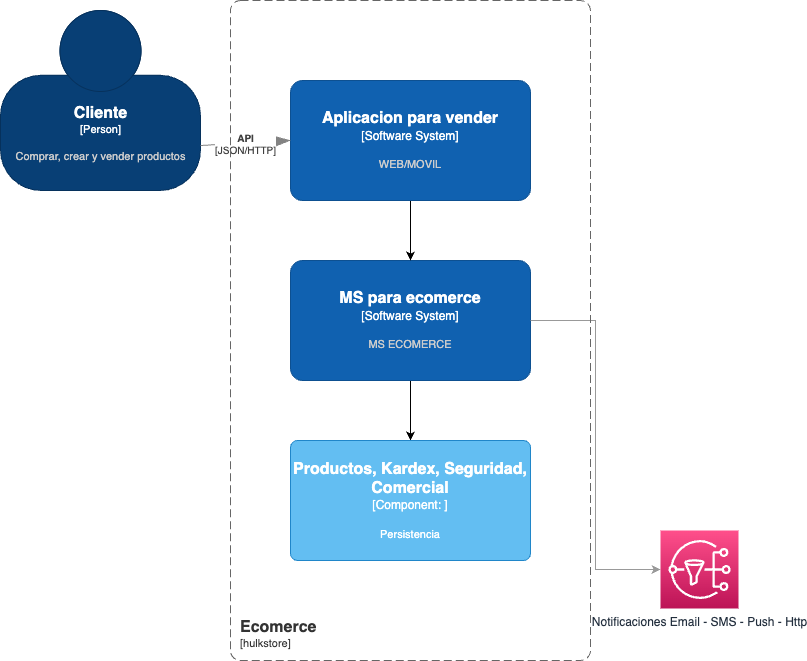
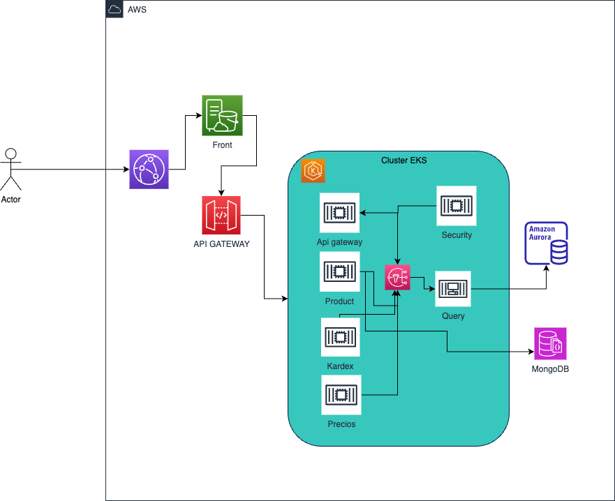

# Prueba Tecnica Hulk Store

En esta documentacion se resuleve la prueba tecnica para el cargo de Lider Tecnico, de igual manera se propone una alternativa de solucion para el problema propuesto.

## Arquitectura de Contexto

El siguiente diagrama nos muestra un contexto general del problema y su solucion, contemplando actores principal, las aplicaciones que consume la tienda y su persistencia

## Arquitectura de Contenedor
El siguiente diagrama nos ilustra la propuesta que se compone de una libreria para la implementacion de la maquina de estados y un microservicio de configuracion para hacer dinamica la parametrizacion de estados y sus  acciones

## Modelo de Clases
El siguiente diagrama de aplicacion ilustra el micro servicio para los productos, se ilustra como base para cada uno de los microservicios que se usaran en la aplicacion.

## Propuesta de arquitectura orientada a Api

El siguiente diagrama ilustra una propuesta a manera de arquitectura de solucion para un api para el sistema de ventas electronica al interior de la compañia.

